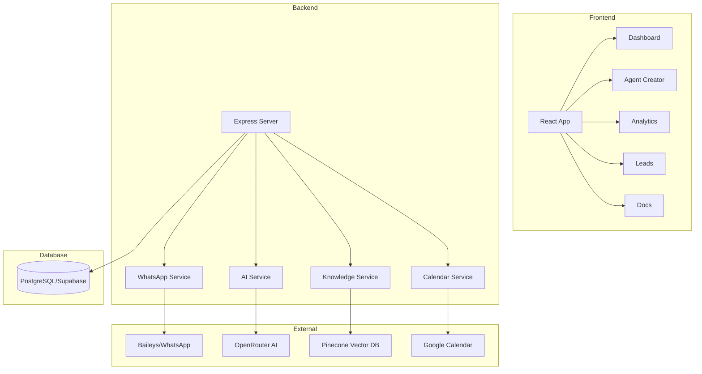

# WAFlow

<div align="center">


**AI-Powered WhatsApp Automation Platform**

Create intelligent chatbots with custom knowledge bases, lead capture, and calendar integration.

[](https://youtu.be/-anZcc3O_MQ)
[](https://github.com/sponsors/shyanukant)
[](LICENSE)

</div>

---

## 🎬 Demo

[](https://youtu.be/-anZcc3O_MQ)

---

## ✨ Features

### Core Features
| Feature | Description |
|---------|-------------|
| 🤖 **AI Agents** | Create intelligent WhatsApp chatbots with custom prompts |
| 📚 **Knowledge Base** | Train with PDFs, DOCX, URLs, Google Docs |
| 🔗 **Easy Setup** | Connect WhatsApp via QR code scan |
| 📊 **Analytics** | Track conversations, messages, and leads |
| 🎯 **Lead Capture** | Auto-collect names, emails, interests |
| 🚀 **Real-time** | Instant AI-powered responses |

### Advanced Features
| Feature | Description |
|---------|-------------|
| 📅 **Calendar Integration** | Google Calendar for meetings/reminders |
| 🌍 **Multi-Language** | Auto-detect and respond in user's language |
| 🎯 **Trigger Detection** | Auto-detect meeting/reminder/lead intents |
| 📝 **Prompt Templates** | 8+ industry templates (E-commerce, SaaS, etc.) |
| 🎭 **Personas** | 5 communication styles (Professional, Friendly, etc.) |
| ⏰ **Follow-ups** | Automated reminder and follow-up sequences |
| � **In-App Docs** | Built-in documentation with templates |

---

## 🏗️ Architecture



---

## 🚀 Quick Start

### Prerequisites

- Node.js 20+
- PostgreSQL (Supabase)
- Pinecone account (free tier works)
- OpenRouter API key

### Installation

```bash
# Clone repository
git clone https://github.com/shyanukant/waflow.git
cd waflow

# Install dependencies
npm install

# Setup environment
cp .env.example .env
# Edit .env with your credentials

# Run migrations
npm run db:migrate

# Start development
npm run dev
```

### Environment Variables

```env
# Supabase
SUPABASE_URL=your-supabase-url
SUPABASE_ANON_KEY=your-anon-key
SUPABASE_SERVICE_ROLE_KEY=your-service-role-key

# AI
OPENROUTER_API_KEY=your-openrouter-key

# Vector Database
PINECONE_API_KEY=your-pinecone-key
PINECONE_INDEX_NAME=waflow-kb

# Google Calendar (Optional)
GOOGLE_CLIENT_ID=your-client-id
GOOGLE_CLIENT_SECRET=your-client-secret
```

---

## 🛠️ Tech Stack

| Layer | Technology |
|-------|------------|
| **Frontend** | React, Vite, TypeScript |
| **Backend** | Node.js, Express, TypeScript |
| **Database** | PostgreSQL (Supabase), Drizzle ORM |
| **AI** | OpenRouter (GPT-4, Claude, etc.) |
| **Vector DB** | Pinecone |
| **WhatsApp** | Baileys (Web API) |
| **Calendar** | Google Calendar API |

---

## 📁 Project Structure

```
waflow/
├── src/
│   ├── client/                 # React Frontend
│   │   ├── components/
│   │   │   ├── Agents/         # Agent creator
│   │   │   ├── Analytics/      # Stats dashboard
│   │   │   ├── Dashboard/      # Main dashboard
│   │   │   ├── Docs/           # In-app documentation
│   │   │   ├── Knowledge/      # Knowledge upload
│   │   │   ├── Leads/          # Lead management
│   │   │   ├── Settings/       # API & calendar settings
│   │   │   └── WhatsApp/       # QR scanner
│   │   └── services/           # API clients
│   │
│   └── server/                 # Express Backend
│       ├── db/                 # Drizzle schema
│       ├── middleware/         # Auth middleware
│       ├── prompts/            # AI prompt system
│       │   ├── systemPrompt.ts # Main prompt builder
│       │   ├── tools.ts        # Function tools
│       │   ├── industryTemplates.ts
│       │   └── personas.ts
│       ├── routes/             # API routes
│       └── services/
│           ├── ai/             # AI agent service
│           ├── calendar/       # Google Calendar
│           ├── knowledge/      # Document processing
│           ├── pinecone/       # Vector store
│           └── whatsapp/       # WhatsApp connection
│
├── dist/                       # Production build
└── sessions/                   # WhatsApp sessions
```

---

## 📝 Prompt Templates

Built-in templates for quick setup:

| Template | Use Case |
|----------|----------|
| 🛒 E-commerce | Product help, shipping, returns |
| 🏠 Real Estate | Listings, viewings, pricing |
| 💻 SaaS | Demos, features, integrations |
| 🏥 Healthcare | Appointments, hours (no medical advice) |
| 💼 Services | Quotes, projects, consultations |
| 📋 Lead Capture | Focus on collecting contacts |
| 📅 Appointments | Meeting scheduling focus |
| 🎧 Support | Issue resolution, FAQs |

Access templates in-app at `/docs`

---

## 🔧 API Endpoints

### Core APIs
```
POST /api/auth/login          # User login
POST /api/auth/register       # User registration
GET  /api/whatsapp/status     # Connection status
POST /api/whatsapp/connect    # Generate QR
GET  /api/agents              # List agents
POST /api/agents              # Create agent
GET  /api/leads               # Get leads
GET  /api/analytics           # Get stats
```

### Calendar APIs
```
GET  /api/calendar/status     # Check connection
GET  /api/calendar/connect    # OAuth URL
GET  /api/calendar/callback   # OAuth callback
```

---

## 🚀 Deployment

### Render (Recommended)

1. Connect GitHub repo to Render
2. **Build Command:** `npm ci && npm run build`
3. **Start Command:** `npm start`
4. Add environment variables
5. Deploy!

### Docker

```bash
docker build -t waflow .
docker run -p 3000:3000 --env-file .env waflow
```

---

## � Documentation

- 📱 **In-App Docs:** `/docs` (after login)
- 📖 **GitHub Wiki:** [Full Documentation](https://github.com/shyanukant/waflow/wiki)

---

## 🤝 Contributing

Contributions welcome! Please:
1. Fork the repository
2. Create a feature branch
3. Submit a pull request

---

## 📄 License

MIT License - see [LICENSE](LICENSE)

---

## 💖 Support

If you find WAFlow useful, consider:
- ⭐ Starring the repo
- 🐛 Reporting bugs
- 💡 Suggesting features
- 💖 [Sponsoring](https://github.com/sponsors/shyanukant)

---

<div align="center">

Made with ❤️ by [Shyanukant](https://github.com/shyanukant)

</div>
